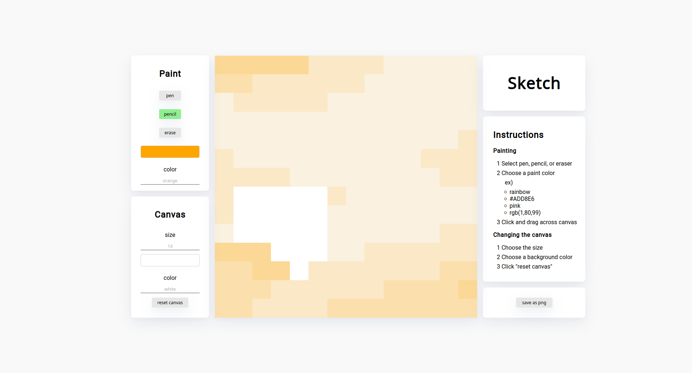

# Sketch

A fun place to draw and color on ([demo](https://drew-chen.github.io/sketch/)).



### Features

* Use a pen to create clean solid lines
* Use a pencil for delicate shading
* Sketch in rainbow color (random color per canvas pixel)!
* Sketch with nearly any color
* Fine-tune your painting by previewing colors and using an eraser
* Adjust the resolution and background colors
* Visual feedback is given if any setting isn't valid
* Save your creation to share with others

### Installation

* Clone or download the repository
* Find the path of index.html on your computer. For example:
```
/home/drew-chen/Downloads/sketch-master/index.html
```
* Copy the path into your browser
* Viola! Enjoy painting :)

### Built With

* HTML, CSS, and vanilla JavaScript
* [html2canvas](https://github.com/niklasvh/html2canvas) Used to save canvas to png
